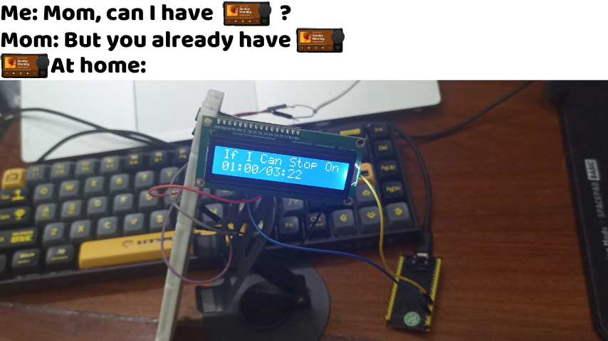
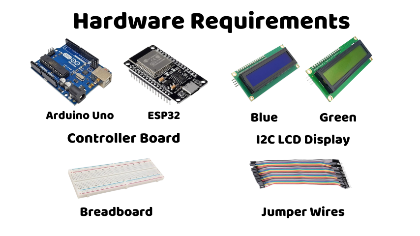

Languages: English / Tiếng Anh | [Vietnamese / Tiếng Việt](./docs/docs/README.vi-VN.md)

  

### Yup, this style is based on [SparklyPower/SparklyPaper](https://github.com/SparklyPower/SparklyPaper)  
*(Please don't take anything too seriously— I just want to have some fun in my README 😭)*

<h1 align="center">🎵 ArduinoThing 🎵</h1>

Have you ever wanted to make your own custom DIY Car Thing? Well, it's great that you've come to the right place!  

**ArduinoThing** is a small program written in **MicroPython** and **C++**.  

This project is compatible with both **ESP32 (WROOM32)** and **Arduino UNO**, and you can customize it to display whatever you want on an **LCD Display** or other devices like an OLED Display, etc.  

## Contents
- [Hardware Requirements](#hardware-requirements)
- [Installation](#installation)
    - [For ESP32](#for-esp32)
    - [For Arduino UNO](#For-Arduino-UNO)

## Hardware Requirements
- Controller Board:
    - 1 ESP32 or Arduino Uno (depending on what you have; for the ESP32, you can buy either the 32 or 38-pin version as it doesn't matter)
- 1 I2C LCD Display
- 1 Breadboard (Optional)
- Jumper Wires

  

## Installation
### For ESP32
Please refer to [ESP32.md](./docs/docs/esp32/esp32.md)
### For Arduino UNO
Please refer to [UNO.md](./docs/docs/uno/uno.md)
- Currently in writing 📝"# ArduinoThing" 
