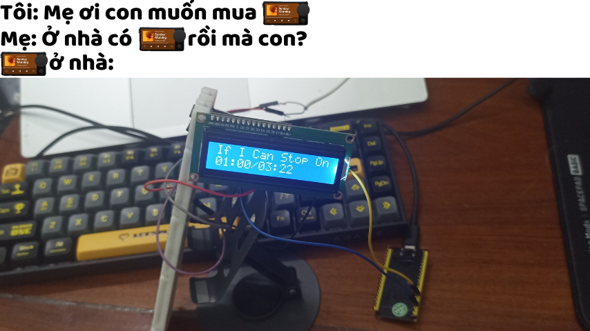
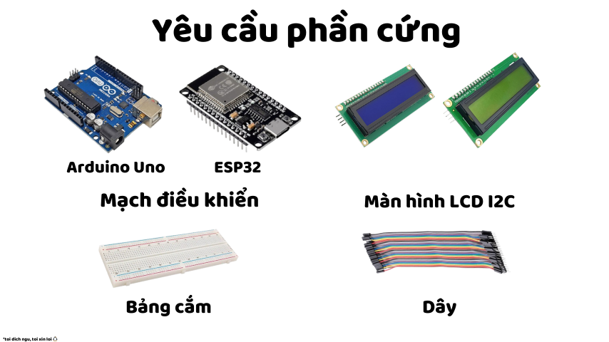

Ngôn ngữ: [English / Tiếng Anh](../../README.md) | Vietnamese / Tiếng Việt

  

### Đúng vậy, phong cách này dựa trên [SparklyPower/SparklyPaper](https://github.com/SparklyPower/SparklyPaper)  
*(Làm ơn đừng có kiểu mà làm 1 cái gì đó mà nghiêm trọng với tôi quá — Tôi chỉ muốn thêm chút vui vẻ vào README này 😭)*

<h1 align="center">🎵 ArduinoThing 🎵</h1>

Bạn đã bao giờ muốn tự làm một thiết bị Car Thing DIY chưa? Thật tuyệt vời vì bạn đã đến đúng chỗ!  

**ArduinoThing** là một chương trình nhỏ được viết bằng **MicroPython** và **C++**.  

Dự án này tương thích với cả **ESP32 (WROOM32)** và **Arduino UNO**, và bạn có thể tùy chỉnh nó để hiển thị bất cứ thứ gì bạn muốn trên **Màn hình LCD** hoặc các thiết bị khác như màn hình OLED, v.v.  

## Mục lục
- [Yêu cầu phần cứng](#yeu-cau-phan-cung)
- [Cài đặt](#cai-dat)
    - [Dành cho ESP32](#danh-cho-esp32)

## Yêu cầu phần cứng
- Bo mạch điều khiển:
    - 1 ESP32 hoặc Arduino Uno (tùy theo bạn có gì; đối với ESP32, bạn có thể mua phiên bản 32 hoặc 38 chân vì không có sự khác biệt)
- 1 Màn hình LCD I2C
- 1 Breadboard (Tùy chọn)
- Dây nối jumper

  

## Cài đặt
### Dành cho ESP32
Vui lòng đọc qua [ESP32.md](../../docs/docs/esp32/esp32-VI.md)
### Dành cho Arduino UNO
Vui lòng đọc qua [UNO.md](../../docs/docs/uno/uno.md)
- Phiên bản cho UNO đang được viết 📝

