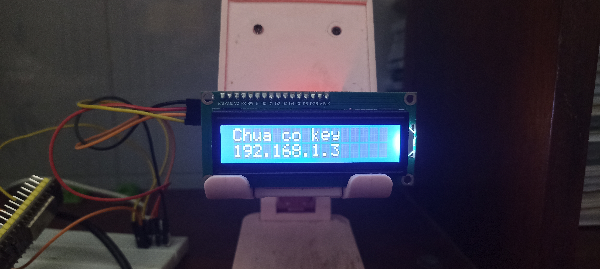

## Cài đặt Dành Cho ESP32

### 📹Video hướng dẫn đầy đủ chi tiết sẽ được làm sớm thôi! Hãy kiên nhẫn nhé

### 📋 Hướng dẫn chi tiết
1. Kết nối ESP32 của bạn với màn hình LCD I2C như hình bên dưới:
<p align="center">
  
</p>

*Sơ đồ kết nối cho ESP32 38 chân.*

2. Cắm ESP32 vào máy tính và nạp firmware **MicroPython** bằng một trong các công cụ sau:
- [BIPES MicroPython Web Installer](https://bipes.net.br/flash/esp-web-tools/)
- [Tài liệu chính thức về ESP32 / WROOM MicroPython (Nạp thủ công)](https://micropython.org/download/ESP32_GENERIC/)

3. Tải xuống firmware mới nhất từ [RELEASES](https://github.com/chezzakowo/ArduinoThing/releases):
- Phiên bản mới nhất: [0.1.0](https://github.com/chezzakowo/ArduinoThing/releases/download/0.1.0/ArduinoThing-ESP32_0.1.0-VI.zip)
- Bản thử nghiệm: 🛠️ Đang phát triển

4. Giải nén tệp ZIP vào một thư mục và đặt tên theo ý bạn.
5. Cài đặt **PyMakr** trên Visual Studio Code (hoặc bất kỳ tiện ích mở rộng nào hỗ trợ giao tiếp với MicroPython ESP32).
6. Mở **Main.py** và chỉnh sửa các cấu hình sau:
```python
# Cấu hình người dùng
SSID = "TÊN WIFI CỦA BẠN"  # Thay bằng tên Wi-Fi của bạn
PASSWORD = "MẬT KHẨU WIFI CỦA BẠN"  # Thay bằng mật khẩu Wi-Fi của bạn
CLIENT_ID = ""  # Thay bằng CLIENT ID từ Spotify Developer
CLIENT_SECRET = ""  # Thay bằng CLIENT SECRET từ Spotify Developer
```
**Lưu ý:**
- Để lấy **CLIENT_ID** và **CLIENT_SECRET**, truy cập [Spotify for Developers](https://developer.spotify.com/) và tạo ứng dụng của bạn.
- Nếu ESP32 của bạn chỉ hỗ trợ **Wi-Fi 2.4 GHz**, hãy đảm bảo kết nối với mạng **2.4 GHz**.

7. Mở **PyMakr**, kết nối với ESP32 của bạn và tải tệp lên.
8. Khởi động lại ESP32. Nếu cài đặt đúng, nó sẽ hiển thị một địa chỉ IP như thế này:
<p align="center">
  
</p>

9. Mở địa chỉ IP hiển thị trên trình duyệt của bạn (**Đảm bảo bạn đã đăng nhập Spotify**).
10. Nếu trang web hiển thị bài hát bạn đang nghe, xin chúc mừng—bạn đã thành công!
<p align="center">
  <!--  -->
  
</p>
