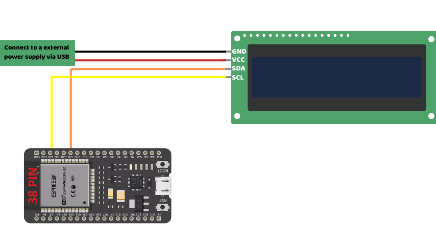
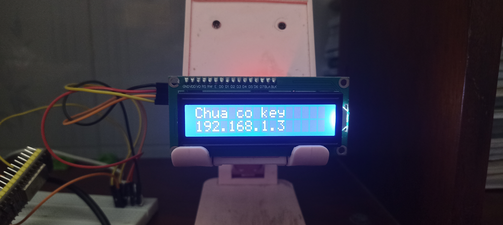

## Installation
### For ESP32

1. Connect your ESP32 to an I2C LCD Display as shown below:
<p align="center">
  
</p>

*Diagram for a 38-pin ESP32.*

2. Plug your ESP32 into the computer and flash it with **MicroPython firmware** using one of these tools:
- [BIPES MicroPython Web Installer](https://bipes.net.br/flash/esp-web-tools/)
- [ESP32 / WROOM MicroPython Official Documentation (Flash locally)](https://micropython.org/download/ESP32_GENERIC/)

3. Download the latest firmware from [RELEASES](https://github.com/chezzakowo/ArduinoThing/releases):
- Latest version: [0.1.0](https://github.com/chezzakowo/ArduinoThing/releases/download/0.1.0/ArduinoThing-ESP32_0.1.0-EN.zip)
- Pre-release: 🛠️ Currently in development

4. Extract the ZIP file into a folder and name it as you prefer.
5. Install **PyMakr** in Visual Studio Code (or any extension that supports communication with MicroPython ESP32).
6. Open **Main.py** and modify the following configurations:
```python
# User config
SSID = "YOUR WIFI NAME"  # Replace with your Wi-Fi name
PASSWORD = "YOUR WIFI PASSWORD"  # Replace with your Wi-Fi password
CLIENT_ID = ""  # Replace with your CLIENT ID from Spotify Developer
CLIENT_SECRET = ""  # Replace with your CLIENT SECRET from Spotify Developer
```
**Note:**
- To get the **CLIENT_ID** and **CLIENT_SECRET**, visit [Spotify for Developers](https://developer.spotify.com/) and create an app.
- If your ESP32 only supports **2.4 GHz Wi-Fi**, make sure to connect to a **2.4 GHz network**.

7. Open **PyMakr**, connect to your ESP32, and upload the files.
8. Restart your ESP32. If everything is set up correctly, it will display an IP address like this:
<p align="center">
  
</p>

9. Open the displayed IP address in your browser (**Make sure you are logged into Spotify**).
10. If the page shows the song you're currently playing, congratulations—you did it!
<p align="center">
  
</p>
